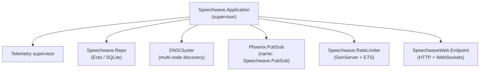
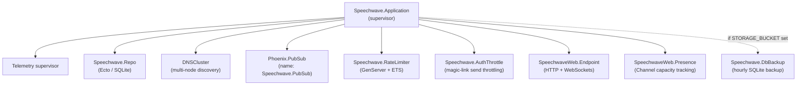
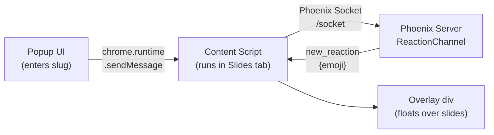
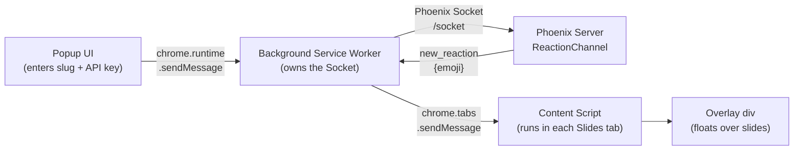

# Explainer & Administration Docs Refresh Implementation Plan

> **For agentic workers:** REQUIRED SUB-SKILL: Use superpowers:subagent-driven-development (recommended) or superpowers:executing-plans to implement this plan task-by-task. Steps use checkbox (`- [ ]`) syntax for tracking.

**Goal:** Bring `docs/explainer.md` and one section of `docs/administration.md` back in sync with the current codebase. This is a documentation-only correction pass — no app code changes.

**Architecture:** Each task replaces one section of `docs/explainer.md` (or, for the last content task, one section of `docs/administration.md`) with corrected prose/code, verified against the live source via grep. Tasks touch the same file sequentially to avoid diff conflicts, in the order the sections appear in the file.

**Tech Stack:** Markdown, Mermaid diagrams, Elixir/JS code samples (prose only — no compiled code).

**Spec:** `docs/specs/2026-07-04-explainer-docs-refresh-design.md`

## Global Constraints

- Documentation-only changes. Do not modify any file under `lib/`, `test/`, `chrome-extension/`, or any other application code.
- Conventional commit format for all commits (e.g. `docs: ...`).
- Every fact introduced (module name, function name, route, code sample) must be verified against the live source with a grep command before the task is considered done — this replaces automated tests for this plan.
- `mix precommit` must still pass after every task (confirms no app code was accidentally touched).
- No `fly.dev` may remain anywhere in `docs/explainer.md` after Task 8 (the last task that touches a fly.dev reference).
- No wording describing a working `/admin` HTTP Basic Auth panel may remain in `docs/explainer.md` after Task 5.

---

### Task 1: Project structure file tree

**Files:**
- Modify: `docs/explainer.md` (section `## Project structure`, currently lines 34–74)

**Interfaces:**
- None — documentation-only change.

- [ ] **Step 1: Replace the file tree**

Find this exact block in `docs/explainer.md`:

```
## Project structure

```
lib/
  speechwave/
    application.ex              # OTP supervision tree
    talks.ex                    # Talk + session context (CRUD, lifecycle)
    talks/talk.ex                # Talk Ecto schema
    talks/talk_session.ex       # TalkSession Ecto schema
    reactions.ex                # Reactions context (create, totals query)
    reactions/reaction.ex       # Reaction Ecto schema
    rate_limiter.ex             # GenServer + ETS rate limiting
    qr_code.ex                  # QR code generation for admin
  speechwave_web/
    live/
      talk_live.ex              # Attendee reaction page (LiveView)
      admin_live.ex              # Admin: talks, sessions panel
      session_analytics_live.ex # Per-session analytics (LiveView)
    channels/
      user_socket.ex            # Socket definition for Chrome extension
      reaction_channel.ex       # Channel: reactions, sessions, slide_changed
    plugs/
      admin_auth.ex             # Basic auth for /admin routes
    endpoint.ex                 # Mounts both socket types
    router.ex                   # Route definitions

chrome-extension/  (github.com/speechwave-live/chrome-extension)
  adapters/
    google_slides.js    # Reads current slide number from Google Slides DOM
    index.js            # Adapter registry (returns adapter for current URL)
  lib/
    fireworks.js        # Pure trigger logic for fireworks animation (dual-export: CJS + window global)
  content/content.js    # Content script: WebSocket, overlay, in-flight tracking, fireworks spawner
  popup/popup.{html,js} # Extension popup UI (connection, session, fireworks toggle)
  manifest.json
  tests/                # Jest tests for adapters and fireworks trigger logic

assets/js/hooks/
  emoji_buttons.js      # Disables buttons + shows cooldown countdown
  emoji_stream.js       # Animates incoming emojis in the browser
```
```

Replace it with:

```
## Project structure

```
lib/
  speechwave/
    application.ex              # OTP supervision tree
    accounts.ex                 # Auth/accounts context (users, tokens, identities, api keys)
    accounts/
      scope.ex                  # Scope struct wrapping the current user
      user.ex                   # User Ecto schema (email, api_key, plan, is_admin)
      user_token.ex             # Magic-link / session tokens
      user_identity.ex          # OAuth identity records (Google/Microsoft/GitHub)
      user_consent.ex           # Marketing-email consent records
      user_notifier.ex          # Login-instructions / notification emails
    plans.ex                    # Tier limits (:free/:pro/:org) + capacity checks
    auth_throttle.ex            # Rate-limits magic-link sends per email/IP
    talks.ex                    # Talk + session context (CRUD, lifecycle)
    talks/talk.ex                # Talk Ecto schema (owned by a user)
    talks/talk_session.ex       # TalkSession Ecto schema
    reactions.ex                # Reactions context (create, totals query)
    reactions/reaction.ex       # Reaction Ecto schema
    rate_limiter.ex             # GenServer + ETS rate limiting
    qr_code.ex                  # QR code generation for the dashboard
  speechwave_web/
    live/
      talk_live.ex              # Attendee reaction page (LiveView)
      dashboard_live.ex         # Speaker dashboard: talks, sessions panel
      session_analytics_live.ex # Per-session analytics (LiveView)
      user_live/
        login.ex                # Magic-link login page
        settings.ex             # Account settings, API key, OAuth connect/disconnect
    channels/
      user_socket.ex            # Socket definition for Chrome extension
      reaction_channel.ex       # Channel: reactions, sessions, slide_changed
    user_auth.ex                 # Auth plugs + live_session on_mount hooks
    presence.ex                  # Phoenix.Presence, used for capacity checks
    controllers/
      user_session_controller.ex # Magic-link consumption, log-out, OAuth callback
    endpoint.ex                 # Mounts both socket types
    router.ex                   # Route definitions

chrome-extension/  (github.com/speechwave-live/chrome-extension)
  background/
    background.js        # MV3 service worker: owns the Socket/Channel lifecycle
  adapters/
    google_slides.js    # Reads current slide number from Google Slides DOM
    index.js            # Adapter registry (returns adapter for current URL)
  lib/
    fireworks.js        # Pure trigger logic for fireworks animation (dual-export: CJS + window global)
    phoenix.js           # Vendored Phoenix client, loaded via importScripts in the service worker
  content/content.js    # Content script: overlay, slide polling, fireworks spawner
  popup/popup.{html,js} # Extension popup UI (connection, API key, session, fireworks toggle)
  manifest.json
  tests/                # Jest tests for adapters, fireworks trigger logic, background worker, popup

assets/js/hooks/
  emoji_buttons.js      # Disables buttons + shows cooldown countdown
  emoji_stream.js       # Animates incoming emojis in the browser
```
```

- [ ] **Step 2: Verify every new path exists**

Run (from repo root, `/Users/tracy/projects/speechwave-live/speechwave`):

```bash
ls lib/speechwave/accounts.ex lib/speechwave/accounts/scope.ex lib/speechwave/accounts/user.ex \
   lib/speechwave/accounts/user_token.ex lib/speechwave/accounts/user_identity.ex \
   lib/speechwave/accounts/user_consent.ex lib/speechwave/accounts/user_notifier.ex \
   lib/speechwave/plans.ex lib/speechwave/auth_throttle.ex \
   lib/speechwave_web/live/dashboard_live.ex lib/speechwave_web/live/user_live/login.ex \
   lib/speechwave_web/live/user_live/settings.ex lib/speechwave_web/user_auth.ex \
   lib/speechwave_web/presence.ex lib/speechwave_web/controllers/user_session_controller.ex
```

Expected: every path printed back, no "No such file or directory" errors.

Also run, against the sibling chrome-extension checkout:

```bash
ls /Users/tracy/projects/speechwave-live/chrome-extension/background/background.js \
   /Users/tracy/projects/speechwave-live/chrome-extension/lib/phoenix.js
```

Expected: both paths printed back.

Confirm the removed paths are actually gone:

```bash
find lib/speechwave_web -iname "*admin*"
```

Expected: no output (empty).

- [ ] **Step 3: Commit**

```bash
git add docs/explainer.md
git commit -m "docs: update explainer.md project structure to match current codebase"
```

---

### Task 2: Data model section

**Files:**
- Modify: `docs/explainer.md` (section `## The data model`, currently lines 78–126)

**Interfaces:**
- None — documentation-only change.

- [ ] **Step 1: Replace the section**

Find this exact block:

```
## The data model

There are three database tables.

**`talks`** — one row per conference talk:

```elixir
schema "talks" do
  field :title, :string   # e.g. "My talk"
  field :slug,  :string   # e.g. "my-talk"  ← used in URL and PubSub topic
  has_many :talk_sessions, TalkSession
  timestamps(type: :utc_datetime)
end
```

Slugs are auto-generated from the title (lowercase, spaces → hyphens, special
chars stripped) and are unique. The slug is the key that ties all three actors
together: it's in the URL, the PubSub topic, and the Channel topic.

**`talk_sessions`** — a recording window within a talk (e.g. "Session 1", "Denver Practice"):

```elixir
schema "talk_sessions" do
  field :label,      :string
  field :started_at, :utc_datetime
  field :ended_at,   :utc_datetime   # nil while active
  belongs_to :talk, Talk
  has_many :reactions, Reaction, on_delete: :delete_all
end
```

Sessions are started and stopped by the speaker via the Chrome extension.
`label` auto-increments ("Session 1", "Session 2", …) but can be renamed from
the admin panel.

**`reactions`** — one row per emoji tap:

```elixir
schema "reactions" do
  field :emoji,       :string
  field :slide_number, :integer, default: 0   # 0 = unknown/before session start
  belongs_to :talk_session, TalkSession
end
```

`slide_number` is `0` when no adapter could read the current slide (e.g. before
a session starts, or on a non-Google-Slides presentation). All slide-`0`
reactions group under a "General" label in the analytics view.
```

Replace it with:

```
## The data model

There are three database tables for the reaction flow (plus an auth/accounts
side — `users`, `users_tokens`, `identities`, `user_consents` — covered in
the "Dashboard flow" section below).

**`talks`** — one row per conference talk, owned by a user:

```elixir
schema "talks" do
  field :title, :string   # e.g. "My talk"
  field :slug,  :string   # e.g. "my-talk"  ← used in URL and PubSub topic
  has_many :talk_sessions, TalkSession
  belongs_to :user, Speechwave.Accounts.User
  timestamps(type: :utc_datetime)
end
```

Slugs are auto-generated from the title (lowercase, spaces → hyphens, special
chars stripped) and are unique. The slug is the key that ties all three actors
together: it's in the URL, the PubSub topic, and the Channel topic. The
`user` association is the owner — it gates dashboard listing, Channel join
(see "The two websocket connections in detail" below), and session-analytics
access.

**`talk_sessions`** — a recording window within a talk (e.g. "Session 1", "Denver Practice"):

```elixir
schema "talk_sessions" do
  field :label,      :string
  field :started_at, :utc_datetime
  field :ended_at,   :utc_datetime   # nil while active
  belongs_to :talk, Talk
  has_many :reactions, Reaction, on_delete: :delete_all
end
```

Sessions are started and stopped by the speaker via the Chrome extension.
`label` auto-increments ("Session 1", "Session 2", …) but can be renamed from
the Dashboard.

**`reactions`** — one row per emoji tap:

```elixir
schema "reactions" do
  field :emoji,       :string
  field :slide_number, :integer, default: 0   # 0 = unknown/before session start
  belongs_to :talk_session, TalkSession
end
```

`slide_number` is `0` when no adapter could read the current slide (e.g. before
a session starts, or on a non-Google-Slides presentation). All slide-`0`
reactions group under a "General" label in the analytics view.
```

- [ ] **Step 2: Verify against source**

```bash
grep -n "belongs_to :user, Speechwave.Accounts.User" lib/speechwave/talks/talk.ex
```

Expected: `10:    belongs_to :user, Speechwave.Accounts.User` (or similar matching line).

```bash
ls lib/speechwave/accounts/user_consent.ex lib/speechwave/accounts/user_token.ex \
   lib/speechwave/accounts/user_identity.ex
```

Expected: all three paths printed back.

- [ ] **Step 3: Commit**

```bash
git add docs/explainer.md
git commit -m "docs: update explainer.md data model for talk ownership"
```

---

### Task 3: Routing section

**Files:**
- Modify: `docs/explainer.md` (section `## Routing`, currently lines 129–145)

**Interfaces:**
- None — documentation-only change.

- [ ] **Step 1: Replace the section**

Find this exact block:

```
## Routing

```elixir
# Public attendee page
scope "/t" do
  live "/:slug", TalkLive
end

# Admin (HTTP Basic Auth required)
scope "/admin" do
  pipe_through [:browser, :admin]
  live "/",                                  AdminLive,            :index
  live "/talks/new",                         AdminLive,            :new
  live "/sessions/:id",                      SessionAnalyticsLive, :show
  live "/sessions/:id/compare/:other_id",    SessionAnalyticsLive, :compare
end
```
```

Replace it with:

```
## Routing

```elixir
# Public — no auth required
scope "/", SpeechwaveWeb do
  pipe_through :browser

  get "/", PageController, :home
  get "/terms", PageController, :terms
  get "/privacy", PageController, :privacy
  live "/t/:slug", TalkLive
end

# Requires login
scope "/", SpeechwaveWeb do
  pipe_through [:browser, :require_authenticated_user]

  live_session :require_authenticated_user,
    on_mount: [{SpeechwaveWeb.UserAuth, :require_authenticated}] do
    live "/dashboard", DashboardLive
    live "/sessions/:id", SessionAnalyticsLive, :show
    live "/sessions/:id/compare/:other_id", SessionAnalyticsLive, :compare
    live "/users/settings", UserLive.Settings, :edit
    live "/users/settings/confirm-email/:token", UserLive.Settings, :confirm_email
  end
end

# Login itself — works whether or not you're already logged in
scope "/", SpeechwaveWeb do
  pipe_through [:browser]

  live_session :current_user,
    on_mount: [{SpeechwaveWeb.UserAuth, :mount_current_scope}] do
    live "/users/log-in", UserLive.Login, :new
    live "/pricing", PricingLive
  end

  get "/users/magic_link/:token", UserSessionController, :magic_link
  delete "/users/log-out", UserSessionController, :delete
end

# OAuth login + connect flows
scope "/auth", SpeechwaveWeb do
  pipe_through :browser

  get "/:provider", UserSessionController, :oauth_authorize
  get "/:provider/callback", UserSessionController, :oauth_callback
end
```

There is no `/admin` scope and no HTTP Basic Auth pipeline. Session-analytics
access is gated by ownership *inside* `SessionAnalyticsLive.mount/3` (it
raises if the session's talk isn't owned by `current_scope.user`), not by a
separate plug — see "Analytics dashboard" below.
```

- [ ] **Step 2: Verify against source**

```bash
diff <(sed -n '24,73p' lib/speechwave_web/router.ex) /dev/null; echo "exit code: $?"
```

This just prints the actual router lines for you to eyeball against what was
just written — a diff against `/dev/null` always "fails" (exit 1) by design,
the point is the printed router content. Confirm by eye that the scopes,
`live_session` names, and route paths match what you just wrote into
`docs/explainer.md`.

```bash
grep -n "scope \"/admin\"\|AdminLive\|:admin\]" lib/speechwave_web/router.ex
```

Expected: no output (empty) — confirms no admin scope exists.

- [ ] **Step 3: Commit**

```bash
git add docs/explainer.md
git commit -m "docs: replace explainer.md routing table with current routes"
```

---

### Task 4: Channel join handshake

**Files:**
- Modify: `docs/explainer.md` (subsection `### Channel socket (\`/socket\`)`, inside `## The two websocket connections in detail`, currently around lines 253–275)

**Interfaces:**
- None — documentation-only change.

- [ ] **Step 1: Insert the join-handshake explanation**

Find this exact block:

```
The `"reactions:*"` pattern means the extension can join any topic matching
that prefix (e.g. `"reactions:my-talk"`).

`check_origin: false` is set on this socket (in `endpoint.ex`) so that the
Chrome extension, which runs from a `chrome-extension://` origin, is allowed
to connect.
```

Replace it with:

```
The `"reactions:*"` pattern means the extension can join any topic matching
that prefix (e.g. `"reactions:my-talk"`).

Joining a topic isn't as open as the socket-level pattern above implies —
`ReactionChannel.join/3` requires an `api_key` param and enforces four checks
before accepting the join:

```elixir
def join("reactions:" <> slug, %{"api_key" => api_key}, socket) do
  with {:talk, %Talks.Talk{} = talk} <- {:talk, Talks.get_talk_by_slug(slug)},
       {:user, %Accounts.User{} = user} <- {:user, Accounts.get_user_by_api_key(api_key)},
       {:owner, true} <- {:owner, talk.user_id == user.id},
       {:capacity, :ok} <-
         {:capacity,
          Plans.check(
            :max_participants,
            user.plan,
            Presence.list("reactions:#{slug}") |> map_size()
          )} do
    Phoenix.PubSub.subscribe(Speechwave.PubSub, "user:#{user.id}:disconnect")
    send(self(), :after_join)
    {:ok, assign(socket, talk: talk, user: user)}
  else
    {:talk, nil} -> {:error, %{reason: "not_found"}}
    {:user, nil} -> {:error, %{reason: "unauthorized"}}
    {:owner, false} -> {:error, %{reason: "unauthorized"}}
    {:capacity, {:error, :limit_reached}} -> {:error, %{reason: "capacity_reached"}}
  end
end
```

In plain terms, joining fails with:
- `"not_found"` — the slug doesn't match any talk
- `"unauthorized"` — the API key doesn't resolve to a user, or resolves to a
  user who doesn't own this talk
- `"capacity_reached"` — the talk owner's plan-based participant limit
  (`Plans.limit(:max_participants, plan)`) has already been reached, tracked
  via `Presence.list/1`

These map directly to what the Chrome extension's popup shows when a
connection attempt fails. A successful join also subscribes the channel
process to `"user:#{user.id}:disconnect"` — if the owner logs out or
regenerates their API key elsewhere, the app broadcasts on that topic and the
channel stops itself (`{:stop, :normal, socket}`), forcing the extension to
reconnect with a fresh key.

`check_origin: false` is set on this socket (in `endpoint.ex`) so that the
Chrome extension, which runs from a `chrome-extension://` origin, is allowed
to connect.
```

- [ ] **Step 2: Verify against source**

```bash
sed -n '1,38p' lib/speechwave_web/channels/reaction_channel.ex
```

Expected: the printed `join/3` function matches what was just written into
`docs/explainer.md` (module names `Talks.Talk`, `Accounts.User`, the four
`with` clauses, the four error reasons, the `Phoenix.PubSub.subscribe`
call, and `send(self(), :after_join)`).

```bash
grep -n "def check" lib/speechwave/plans.ex
```

Expected: `@spec check(feature(), plan(), non_neg_integer()) :: :ok | {:error, :limit_reached}` and `def check(feature, plan, current_count) when ...` — confirms the `Plans.check/3` reference is accurate.

- [ ] **Step 3: Commit**

```bash
git add docs/explainer.md
git commit -m "docs: describe api_key/ownership/capacity channel join handshake"
```

---

### Task 5: "Admin flow" → "Dashboard flow"

**Files:**
- Modify: `docs/explainer.md` (section `## Admin flow`, currently lines 447–459)

**Interfaces:**
- None — documentation-only change.

- [ ] **Step 1: Replace the section**

Find this exact block:

```
## Admin flow

The admin panel at `/admin` is protected by HTTP Basic Auth (`AdminAuth` plug).
From there, an organiser can:

1. Create a talk: enter a title, the slug is auto-generated
2. Get a QR code: the `QRCode` module wraps `EQRCode` to generate a PNG
   encoded as a base64 data URI, ready to embed in an `` tag or download

The QR code encodes the full attendee URL
(`https://speechwave.fly.dev/t/my-talk`), so speakers can display it on their
first slide.
```

Replace it with:

```
## Dashboard flow

There's no HTTP Basic Auth admin panel anymore — the Dashboard at
`/dashboard` requires a logged-in user. Login is magic-link (the app emails a
one-time token) or OAuth (Google, Microsoft, or GitHub, via `/auth/:provider`
— see the Routing section above); there's no username/password.

From the Dashboard, a speaker can:

1. Create a talk: enter a title, the slug is auto-generated, and the talk is
   scoped to the logged-in user (`Talks.create_talk(scope, attrs)` sets
   `user_id` from `scope.user.id`)
2. Get a QR code: the `QRCode` module wraps `EQRCode` to generate a PNG
   encoded as a base64 data URI, ready to embed in an `` tag or download

The QR code encodes the talk's full attendee URL via
`SpeechwaveWeb.Endpoint.url() <> "/t/#{talk.slug}"` (e.g.
`https://speechwave.live/t/my-talk`), so speakers can display it on their
first slide.

`User` has an `is_admin` boolean field, and the Dashboard shows a "Super-admin
controls coming soon" placeholder banner to admins — but the super-admin
panel itself isn't built yet (it's a roadmap item). Don't take that banner as
a sign a working admin panel exists.
```

- [ ] **Step 2: Verify against source**

```bash
grep -n "create_talk" lib/speechwave_web/live/dashboard_live.ex
grep -n "talk_url\|Endpoint.url" lib/speechwave_web/live/dashboard_live.ex
grep -n "is_admin\|Super-admin" lib/speechwave_web/live/dashboard_live.html.heex
```

Expected: `create_talk` call present (`Talks.create_talk(scope, attrs)`),
`talk_url` defined as `SpeechwaveWeb.Endpoint.url() <> "/t/#{talk.slug}"`,
and both `is_admin` and "Super-admin" found in the `.heex` template.

```bash
grep -n "fly.dev" docs/explainer.md
```

Expected: only the one remaining occurrence in the Chrome extension section
(fixed in Task 8) — the "Admin flow"/"Dashboard flow" occurrence should now
be gone.

- [ ] **Step 3: Commit**

```bash
git add docs/explainer.md
git commit -m "docs: replace explainer.md admin flow with dashboard flow"
```

---

### Task 6: Supervision tree

**Files:**
- Modify: `docs/explainer.md` (section `## Supervision tree`, currently lines 462–479)

**Interfaces:**
- None — documentation-only change.

- [ ] **Step 1: Replace the section**

Find this exact block:

```
## Supervision tree

Every long-lived process in Elixir/OTP lives under a supervisor. Here's
Speechwave's:



If `RateLimiter` crashes, the supervisor restarts it automatically. When it
restarts, the ETS table is recreated empty and this is fine, it just means the
cooldown state is lost and everyone gets a fresh window to react.
```

Replace it with:

```
## Supervision tree

Every long-lived process in Elixir/OTP lives under a supervisor. Here's
Speechwave's:



If `RateLimiter` crashes, the supervisor restarts it automatically. When it
restarts, the ETS table is recreated empty and this is fine, it just means the
cooldown state is lost and everyone gets a fresh window to react.

`Speechwave.DbBackup` only starts when a `STORAGE_BUCKET` environment
variable is configured (production); see `docs/administration.md` for the
backup/restore runbook.
```

- [ ] **Step 2: Verify against source**

```bash
sed -n '12,22p' lib/speechwave/application.ex
```

Expected output matches:

```
      [
        SpeechwaveWeb.Telemetry,
        Speechwave.Repo,
        {DNSCluster, query: Application.get_env(:speechwave, :dns_cluster_query) || :ignore},
        {Phoenix.PubSub, name: Speechwave.PubSub},
        Speechwave.RateLimiter,
        Speechwave.AuthThrottle,
        SpeechwaveWeb.Endpoint,
        SpeechwaveWeb.Presence
      ] ++ backup_children()
```

```bash
grep -n "STORAGE_BUCKET" lib/speechwave/application.ex
```

Expected: `defp backup_children do` guard checking `System.get_env("STORAGE_BUCKET")`.

- [ ] **Step 3: Commit**

```bash
git add docs/explainer.md
git commit -m "docs: add AuthThrottle, Presence, DbBackup to explainer.md supervision tree"
```

---

### Task 7: Talk sessions section

**Files:**
- Modify: `docs/explainer.md` (section `## Talk sessions`, currently lines 483–495)

**Interfaces:**
- None — documentation-only change.

- [ ] **Step 1: Replace the section**

Find this exact block:

```
## Talk sessions

A *session* is a recording window. The speaker starts one (via the extension popup or `start_session` channel message) before presenting, and stops it afterward. Reactions recorded while a session is active are persisted with a slide number for later analytics.

Session lifecycle is managed in `Speechwave.Talks`:

- `start_session/1` — idempotent: returns the existing active session if one is open, otherwise creates a new one labeled "Session N" where N is one more than the total number of sessions for that talk.
- `stop_session/1` — idempotent: if `ended_at` is already set, returns the session unchanged.
- `get_active_session/1` — queries for a session with `ended_at IS NULL`.
- `list_sessions/1` — returns sessions with reaction counts, newest first.
- `rename_session/2`, `delete_session/1` — admin operations.

The `ReactionChannel` exposes `start_session` and `stop_session` as channel messages so the Chrome extension can control sessions without going through the web UI.
```

Replace it with:

```
## Talk sessions

A *session* is a recording window. The speaker starts one (via the extension popup or `start_session` channel message) before presenting, and stops it afterward. Reactions recorded while a session is active are persisted with a slide number for later analytics.

Session lifecycle is managed in `Speechwave.Talks`:

- `start_session/1` — idempotent: returns the existing active session if one is open, otherwise creates a new one labeled "Session N" where N is one more than the total number of sessions for that talk.
- `stop_session/1` — idempotent: if `ended_at` is already set, returns the session unchanged.
- `get_active_session/1` — queries for a session with `ended_at IS NULL`.
- `list_sessions/1` — returns sessions with reaction counts, newest first.
- `rename_session/2`, `delete_session/1` — dashboard operations.

The `ReactionChannel` exposes `start_session` and `stop_session` as channel messages so the Chrome extension can control sessions without going through the web UI.

`start_session` is plan-gated: before creating a session, the channel calls
`Talks.count_full_sessions_this_month/1` (a "full" session is one lasting
longer than 10 minutes) and checks it against
`Plans.check(:full_sessions_per_month, user.plan, full_count)`. If the
owner's plan limit is reached, the channel replies
`{:error, %{reason: "session_limit_reached"}}` instead of creating the
session.

The channel also tracks each connected participant via
`SpeechwaveWeb.Presence` (used for the `max_participants` capacity check on
join — see "The two websocket connections in detail" above) and subscribes to
`"user:#{user.id}:disconnect"`, so that logging out or regenerating an API
key server-side force-disconnects the extension's channel.
```

- [ ] **Step 2: Verify against source**

```bash
grep -n "count_full_sessions_this_month\|def start_session\|def stop_session\|def get_active_session\|def list_sessions\|def rename_session\|def delete_session" lib/speechwave/talks.ex
```

Expected: all six function names found.

```bash
grep -n "full_sessions_per_month\|session_limit_reached\|Presence.track\|user:.*:disconnect" lib/speechwave_web/channels/reaction_channel.ex
```

Expected: matches for the plan check, the `"session_limit_reached"` reason, `Presence.track`, and the `"user:#{user.id}:disconnect"` subscribe.

- [ ] **Step 3: Commit**

```bash
git add docs/explainer.md
git commit -m "docs: document session plan limits and Presence tracking in explainer.md"
```

---

### Task 8: Chrome extension ownership model

**Files:**
- Modify: `docs/explainer.md` (section `## The Chrome extension`, currently lines 343–363, the part *before* the "Fireworks animation" subsection — do not touch "Fireworks animation," it's unchanged)

**Interfaces:**
- None — documentation-only change.

- [ ] **Step 1: Replace the section**

Find this exact block:

```
## The Chrome extension

The extension has two parts:

**Popup (`popup.html` + `popup.js`)** — A small UI that appears when you click
the extension icon. The speaker enters the talk slug and clicks "Connect". The
popup sends a message to the content script via `chrome.runtime.sendMessage`.

**Content script (`content.js`)** — Injected into Google Slides pages. It:

1. Connects a Phoenix `Socket` to `wss://speechwave.fly.dev/socket`
2. Joins the `reactions:${slug}` channel
3. Listens for `"new_reaction"` messages and calls `spawnEmoji()`


```

Replace it with:

```
## The Chrome extension

The extension has three parts:

**Popup (`popup.html` + `popup.js`)** — A small UI that appears when you click
the extension icon. The speaker enters the talk slug and their API key (from
Account Settings; validated client-side as 64-char hex) and clicks "Connect".
The popup sends messages to the **background service worker**, not the
content script, via `chrome.runtime.sendMessage`.

**Background service worker (`background/background.js`)** — An MV3
background script that owns the Phoenix `Socket`/Channel connection for the
entire lifetime of the extension (not just one tab). It:

1. Connects a Phoenix `Socket` to `wss://speechwave.live/socket`
2. Joins `reactions:${slug}` with `{ api_key: apiKey }` — this is the
   `ReactionChannel.join/3` call described above
3. On `"new_reaction"`, relays to every open Google Slides tab via
   `chrome.tabs.sendMessage(tab.id, { type: "RENDER_EMOJI", emoji })`
4. Relays `start_session`/`stop_session`/`slide_changed` channel pushes on
   behalf of the popup and content script

Because MV3 service workers can be terminated and restarted by Chrome at any
time independent of open tabs, `background.js` has explicit reconnect/rejoin
logic and guards against acting on a stale ("zombie") socket left over from
before a restart.

**Content script (`content.js`)** — Injected into Google Slides pages. It no
longer owns any socket connection. It:

1. Renders emojis when it receives `{ type: "RENDER_EMOJI", emoji }` from the
   background worker, by calling `spawnEmoji()`
2. Polls the current slide number and reports changes to the background
   worker via `chrome.runtime.sendMessage({ type: "SLIDE_CHANGED", slide })`
   (see "Slide tracking" below)
3. Toggles the fireworks animation on/off based on `SET_FIREWORKS` messages


```

- [ ] **Step 2: Verify against source**

```bash
grep -n "HOST =\|s.channel(\|RENDER_EMOJI\|chrome.tabs.sendMessage" \
  /Users/tracy/projects/speechwave-live/chrome-extension/background/background.js
```

Expected: `HOST = ... "wss://speechwave.live"`, `s.channel(\`reactions:${slug}\`, { api_key: apiKey })`, `broadcastToSlidesTabs({ type: 'RENDER_EMOJI', emoji })`, and a `chrome.tabs.sendMessage` call — all present.

```bash
grep -n "RENDER_EMOJI\|SLIDE_CHANGED\|SET_FIREWORKS\|Socket\b" \
  /Users/tracy/projects/speechwave-live/chrome-extension/content/content.js
```

Expected: `RENDER_EMOJI`, `SLIDE_CHANGED`, `SET_FIREWORKS` all present; no
`new Socket` or Phoenix channel-join call in this file (confirms content.js
no longer owns the socket).

```bash
grep -n "fly.dev" docs/explainer.md
```

Expected: no output (empty) — this was the last remaining `fly.dev` occurrence in the file.

- [ ] **Step 3: Commit**

```bash
git add docs/explainer.md
git commit -m "docs: describe background-service-worker-owned extension architecture"
```

---

### Task 9: Slide tracking section

**Files:**
- Modify: `docs/explainer.md` (section `## Slide tracking`, currently lines 499–566)

**Interfaces:**
- None — documentation-only change.

- [ ] **Step 1: Replace the section**

Find this exact block:

```
## Slide tracking

When the speaker's Chrome extension is connected, it detects the current slide number and sends `slide_changed` messages to the server so reactions can be stamped with slide context.

### Adapter registry

Different presentation tools expose the current slide number differently. The extension uses an **adapter registry** (`adapters/index.js` in the [chrome-extension repo](https://github.com/speechwave-live/chrome-extension)) that picks the right adapter based on the current page URL:

```javascript
// index.js
function getAdapter(url) {
  if (url.includes("docs.google.com/presentation")) {
    return GoogleSlidesAdapter;
  }
  return { getSlide: () => 0 };  // fallback for unknown platforms
}
```

The Google Slides adapter (`adapters/google_slides.js`) reads the slide number from the DOM:

```javascript
function getSlide() {
  const input = document.querySelector('input[aria-label*="Slide"]');
  if (!input) return 0;
  const n = parseInt(input.value, 10);
  return isNaN(n) ? 0 : n;
}
```

This is brittle by nature (Google could change the DOM), but it's the only option without a first-party API. The fixture-based Jest tests in `tests/` (chrome-extension repo) snapshot the relevant DOM so regressions are caught before they ship.

### MutationObserver

The content script sets up a `MutationObserver` to watch for attribute changes on the slide input:

```javascript
function startSlideObserver() {
  const observer = new MutationObserver(() => {
    const slide = getAdapter(window.location.href).getSlide();
    if (slide !== currentSlide && slide > 0) {
      currentSlide = slide;
      channel.push("slide_changed", { slide });
    }
  });
  observer.observe(document.body, {
    subtree: true,
    attributeFilter: ["value", "aria-label"]
  });
}
```

Slide `0` is a sentinel for "unknown" and is never sent — the server silently ignores it too.

The popup also displays the current slide number in real time ("Slide 3" or "Slide —" for unknown). This serves as an immediate sanity check that the adapter is reading the DOM correctly — if the number doesn't update when you advance slides, the DOM structure has changed and the adapter selector needs updating.

### Server-side handling

`ReactionChannel` handles `slide_changed` and broadcasts to a separate `"slides:#{slug}"` PubSub topic:

```elixir
def handle_in("slide_changed", %{"slide" => slide}, socket)
    when is_integer(slide) and slide > 0 do
  Endpoint.broadcast!("slides:#{socket.assigns.talk.slug}", "slide_changed", %{slide: slide})
  {:reply, :ok, socket}
end
```

`TalkLive` subscribes to this topic and updates `current_slide` in its assigns, so the next reaction tap carries the correct slide number.
```

Replace it with:

```
## Slide tracking

When the speaker's Chrome extension is connected, it detects the current slide number and sends `slide_changed` messages to the server so reactions can be stamped with slide context.

### Adapter registry

Different presentation tools expose the current slide number differently. The extension uses an **adapter registry** (`adapters/index.js` in the [chrome-extension repo](https://github.com/speechwave-live/chrome-extension)) that picks the right adapter based on the current page URL:

```javascript
// index.js
function getAdapter(url) {
  if (url.includes("docs.google.com/presentation")) {
    return GoogleSlidesAdapter;
  }
  return { getSlide: () => 0 };  // fallback for unknown platforms
}
```

The Google Slides adapter (`adapters/google_slides.js`) reads the slide number from an accessibility element's `aria-label`, searching the document and any accessible same-origin iframes:

```javascript
function getSlide() {
  const docs = [document];
  for (const iframe of document.querySelectorAll("iframe")) {
    try {
      if (iframe.contentDocument) docs.push(iframe.contentDocument);
    } catch (e) {
      // cross-origin iframe — skip
    }
  }

  for (const doc of docs) {
    const el = doc.querySelector('.punch-viewer-svgpage-a11yelement[aria-label*="Slide"]');
    if (el) {
      const match = el.getAttribute("aria-label").match(/^Slide (\d+)/);
      if (match) return parseInt(match[1], 10);
    }
  }

  return 0;
}
```

**Important caveat:** this element only exists once the slideshow is actually
running (fullscreen or windowed presentation mode) — it is NOT present in
the Slides editor view. Slide tracking therefore does nothing until the
speaker starts presenting.

This is brittle by nature (Google could change the DOM), but it's the only option without a first-party API. The fixture-based Jest tests in `tests/` (chrome-extension repo) snapshot the relevant DOM so regressions are caught before they ship.

### Polling

The content script polls the adapter every 500ms and reports changes to the
background service worker (rather than pushing to the channel directly — see
"The Chrome extension" above):

```javascript
function startSlideObserver() {
  const registry = window.SpeechwaveAdapterRegistry;
  if (!registry) return;

  const adapter = registry.getAdapter(window.location.href);
  if (!adapter) return;

  function checkSlide() {
    const slide = adapter.getSlide();
    if (slide !== currentSlide) {
      currentSlide = slide;
      chrome.runtime.sendMessage({ type: "SLIDE_CHANGED", slide: currentSlide }, () => {
        void chrome.runtime.lastError;
      });
    }
  }

  checkSlide();
  slideInterval = setInterval(checkSlide, 500);
}
```

The background worker is the one that actually pushes to the channel:

```javascript
} else if (msg.type === 'SLIDE_CHANGED') {
  currentSlide = msg.slide;
  if (isConnected() && channel) {
    channel.push('slide_changed', { slide: currentSlide });
  }
  notifyPopup({ type: 'SLIDE_CHANGED', slide: currentSlide });
```

The popup also displays the current slide number in real time ("Slide 3" or "Slide —" for unknown). This serves as an immediate sanity check that the adapter is reading the DOM correctly — if the number doesn't update when you advance slides, the DOM structure has changed and the adapter selector needs updating.

### Server-side handling

`ReactionChannel` handles `slide_changed` and broadcasts to a separate `"slides:#{slug}"` PubSub topic:

```elixir
def handle_in("slide_changed", %{"slide" => slide}, socket)
    when is_integer(slide) and slide > 0 do
  SpeechwaveWeb.Endpoint.broadcast!(
    "slides:#{socket.assigns.talk.slug}",
    "slide_changed",
    %{slide: slide}
  )

  {:reply, :ok, socket}
end
```

Slide `0` is a sentinel for "unknown": this `when slide > 0` guard means a
`0` never gets broadcast — it falls through to a second `handle_in` clause
that just acknowledges the message without broadcasting anything.

`TalkLive` subscribes to the `"slides:#{slug}"` topic and updates
`current_slide` in its assigns, so the next reaction tap carries the correct
slide number.
```

- [ ] **Step 2: Verify against source**

```bash
grep -n "punch-viewer-svgpage-a11yelement" /Users/tracy/projects/speechwave-live/chrome-extension/adapters/google_slides.js
grep -n "setInterval(checkSlide, 500)" /Users/tracy/projects/speechwave-live/chrome-extension/content/content.js
grep -n "MutationObserver" /Users/tracy/projects/speechwave-live/chrome-extension/content/content.js /Users/tracy/projects/speechwave-live/chrome-extension/adapters/google_slides.js
```

Expected: the first two greps find matches; the third (`MutationObserver`) finds nothing anywhere in the extension repo.

```bash
grep -n "handle_in(\"slide_changed\"" -A 12 lib/speechwave_web/channels/reaction_channel.ex
```

Expected: matches the two `handle_in("slide_changed", ...)` clauses (the guarded broadcast and the fallback) exactly as written into the doc.

- [ ] **Step 3: Commit**

```bash
git add docs/explainer.md
git commit -m "docs: update slide tracking from MutationObserver to polling"
```

---

### Task 10: Analytics dashboard route fixes

**Files:**
- Modify: `docs/explainer.md` (section `## Analytics dashboard`, currently lines 570–597)

**Interfaces:**
- None — documentation-only change.

- [ ] **Step 1: Fix the intro line**

Find this exact text:

```
After a talk, the speaker can review per-slide engagement at `/admin/sessions/:id`.
```

Replace it with:

```
After a talk, the speaker can review per-slide engagement at `/sessions/:id`.
Access requires being logged in as the talk's owner —
`SessionAnalyticsLive.mount/3` calls
`Talks.get_talk!(current_scope, session.talk_id)`, which raises if the
session's talk isn't owned by the current user.
```

- [ ] **Step 2: Fix the comparison-mode paragraph and dashboard link**

Find this exact block:

```
### Comparison mode

At `/admin/sessions/:id/compare/:other_id`, `SessionAnalyticsLive` loads both sessions and renders two charts side by side. The comparison covers all slides that appeared in *either* session (union of slide numbers), so gaps are visible.

The admin sessions panel links to the analytics view for each session via `navigate={"/admin/sessions/#{session.id}"}`.
```

Replace it with:

```
### Comparison mode

At `/sessions/:id/compare/:other_id`, `SessionAnalyticsLive` loads both sessions and renders two charts side by side. The comparison covers all slides that appeared in *either* session (union of slide numbers), so gaps are visible.

The dashboard's sessions panel links to the analytics view for each session via `navigate={"/sessions/#{session.id}"}`.
```

- [ ] **Step 3: Verify against source**

```bash
grep -n "get_talk!" lib/speechwave_web/live/session_analytics_live.ex
grep -n "navigate.*sessions" lib/speechwave_web/live/dashboard_live.html.heex
```

Expected: `get_talk!` call found in `session_analytics_live.ex`; a `navigate={"/sessions/#{session.id}"}`-shaped link (or equivalent) found in the dashboard template.

```bash
grep -n "/admin/sessions" docs/explainer.md
```

Expected: no output (empty).

- [ ] **Step 4: Commit**

```bash
git add docs/explainer.md
git commit -m "docs: fix analytics dashboard route paths in explainer.md"
```

---

### Task 11: Glossary table

**Files:**
- Modify: `docs/explainer.md` (closing table, currently lines 602–621)

**Interfaces:**
- None — documentation-only change.

- [ ] **Step 1: Fix and extend the table**

Find this exact row:

```
| **SessionAnalyticsLive**| Admin-only LiveView: per-slide bar charts and session comparison mode           |
```

Replace it with:

```
| **SessionAnalyticsLive**| Owner-only, authenticated-user LiveView: per-slide bar charts and session comparison mode |
| **Scope / `current_scope`** | Wraps the logged-in user; assigned to LiveView sockets and Plug conns by `UserAuth` on_mount hooks/plugs |
| **`api_key`**           | Per-user secret; the Chrome extension passes it on Channel join to authenticate and identify the talk owner |
| **Plans**                | Tier limits (`:free`/`:pro`/`:org`) for `:max_participants` and `:full_sessions_per_month`; enforced via `Plans.check/3` |
| **Presence**              | `SpeechwaveWeb.Presence`; tracks connected Channel participants per talk to enforce the `max_participants` limit |
| **Background service worker** | MV3 extension component (`background/background.js`) that owns the Socket/Channel connection, replacing the old content-script-owned socket |
```

- [ ] **Step 2: Verify against source**

```bash
grep -n "defmodule Speechwave.Accounts.Scope" lib/speechwave/accounts/scope.ex
grep -n "def check\|@type feature" lib/speechwave/plans.ex
grep -n "defmodule SpeechwaveWeb.Presence" lib/speechwave_web/presence.ex
```

Expected: all three matches found, confirming the module names in the new
rows are accurate.

- [ ] **Step 3: Commit**

```bash
git add docs/explainer.md
git commit -m "docs: fix and extend explainer.md glossary table"
```

---

### Task 12: Minor code-sample conformance fixes

**Files:**
- Modify: `docs/explainer.md` (subsection `**2. Rate limiting and persistence**`, inside "The full emoji journey," currently around lines 187–206; and section `## LiveView mount and subscription`, currently lines 414–443)

**Interfaces:**
- None — documentation-only change.

- [ ] **Step 1: Fix the "Rate limiting and persistence" code sample**

Find this exact block:

```
**2. Rate limiting and persistence**

```elixir
def handle_event("react", %{"emoji" => emoji}, socket) do
  if RateLimiter.allow?(socket.id) do
    slug = socket.assigns.talk.slug
    if session = Talks.get_active_session(socket.assigns.talk.id) do
      Reactions.create_reaction(session, emoji, socket.assigns.current_slide)
    end
    Endpoint.broadcast!("reactions:#{slug}", "new_reaction", %{emoji: emoji})
  end
  {:noreply, socket}
end
```

If a session is active, the reaction is persisted to the database with the current slide number. `current_slide` is tracked in the socket assigns and updated whenever a `slide_changed` message arrives over PubSub (see the Slide Tracking section below).

`RateLimiter` uses an ETS table (an in-memory key/value store built into the
BEAM) to track the last reaction time per session. If less than 3 seconds have
passed, the event is silently dropped.
```

Replace it with:

```
**2. Rate limiting and persistence**

```elixir
def handle_event("react", %{"emoji" => emoji}, socket) do
  if RateLimiter.allow?(socket.assigns.session_id) do
    case Talks.get_active_session(socket.assigns.talk.id) do
      nil -> :ok
      session -> Reactions.create_reaction(session, emoji, socket.assigns.current_slide)
    end

    SpeechwaveWeb.Endpoint.broadcast!(
      "reactions:#{socket.assigns.talk.slug}",
      "new_reaction",
      %{emoji: emoji}
    )
  end

  {:noreply, socket}
end
```

If a session is active, the reaction is persisted to the database with the current slide number. `current_slide` is tracked in the socket assigns and updated whenever a `slide_changed` message arrives over PubSub (see the Slide Tracking section below).

`RateLimiter` uses an ETS table (an in-memory key/value store built into the
BEAM) to track the last reaction time per session. If less than 3 seconds have
passed, the event is silently dropped. `session_id` is assigned once in
`mount/3` (`session_id: socket.id`) — see "LiveView mount and subscription"
below.
```

- [ ] **Step 2: Fix the "LiveView mount and subscription" section**

Find this exact block:

```
## LiveView mount and subscription

When an attendee navigates to `/t/my-talk`, Phoenix renders `TalkLive`. The
`mount/3` callback runs twice: once server-side for the initial HTML render,
and once after the WebSocket connects:

```elixir
def mount(%{"slug" => slug}, _session, socket) do
  talk = Talks.get_talk_by_slug(slug)

  if connected?(socket) do
    Endpoint.subscribe("reactions:#{slug}")
  end

  {:ok, assign(socket, talk: talk, emojis: ["❤️", "😂", "🔥", "👏", "🤯"])}
end
```

`connected?(socket)` is `false` on the first (HTTP) render and `true` after the
WebSocket upgrades. Subscribing only when connected avoids duplicate
subscriptions and wasted work during the initial render.

If the slug doesn't exist in the database, the LiveView redirects to the home page:

```elixir
case Talks.get_talk_by_slug(slug) do
  nil  -> {:ok, push_navigate(socket, to: ~p"/")}
  talk -> {:ok, assign(socket, talk: talk, ...)}
end
```
```

Replace it with:

```
## LiveView mount and subscription

When an attendee navigates to `/t/my-talk`, Phoenix renders `TalkLive`. The
`mount/3` callback runs twice: once server-side for the initial HTML render,
and once after the WebSocket connects:

```elixir
def mount(%{"slug" => slug}, _session, socket) do
  case Talks.get_talk_by_slug(slug) do
    nil ->
      {:ok, redirect(socket, to: "/")}

    talk ->
      if connected?(socket) do
        Phoenix.PubSub.subscribe(Speechwave.PubSub, "reactions:#{slug}")
        Phoenix.PubSub.subscribe(Speechwave.PubSub, "slides:#{slug}")
      end

      {:ok, assign(socket, talk: talk, emojis: @emojis, session_id: socket.id, current_slide: 0)}
  end
end
```

`connected?(socket)` is `false` on the first (HTTP) render and `true` after the
WebSocket upgrades. Subscribing only when connected avoids duplicate
subscriptions and wasted work during the initial render. Two topics are
subscribed: `"reactions:#{slug}"` (see "The full emoji journey" above) and
`"slides:#{slug}"` (see "Slide tracking" below).

If the slug doesn't exist in the database, the LiveView redirects to the
home page (`redirect(socket, to: "/")`) instead of assigning a talk.
```

- [ ] **Step 3: Verify against source**

```bash
sed -n '8,39p' lib/speechwave_web/live/talk_live.ex
```

Expected: the printed `mount/3` and `handle_event("react", ...)` functions
match what was just written into `docs/explainer.md`, including
`socket.assigns.session_id`, the `case`/`nil ->`/`redirect` structure, both
`Phoenix.PubSub.subscribe` calls, and the fully-qualified
`SpeechwaveWeb.Endpoint.broadcast!/3` call.

- [ ] **Step 4: Commit**

```bash
git add docs/explainer.md
git commit -m "docs: conform explainer.md code samples to match live source"
```

---

### Task 13: `docs/administration.md` — replace password-reset runbook

**Files:**
- Modify: `docs/administration.md` (section `## How to manually reset a user's password`, currently lines 20–36)

**Interfaces:**
- None — documentation-only change.

- [ ] **Step 1: Replace the section**

Find this exact block:

```
## How to manually reset a user's password

Connect to the running production node via a remote IEx console:

```sh
fly ssh console --app speechwave --pty -C "/app/bin/speechwave remote"
```

Then in IEx:

```elixir
user = Speechwave.Accounts.get_user_by_email("user@example.com")
Speechwave.Accounts.update_user_password(user, %{password: "newpassword123", password_confirmation: "newpassword123"})
```

A successful reset returns `{:ok, {%User{}, [...]}}` and invalidates all
existing sessions for that user, requiring them to log in again.
```

Replace it with:

```
## How to send a user a fresh login link

Speechwave auth is passwordless (magic link or OAuth) — there is no password
to reset. If a user is stuck (e.g. their magic-link email never arrived),
connect to the running production node via a remote IEx console:

```sh
fly ssh console --app speechwave --pty -C "/app/bin/speechwave remote"
```

Then in IEx:

```elixir
user = Speechwave.Accounts.get_user_by_email("user@example.com")
url_fun = fn token -> "https://speechwave.live/users/magic_link/#{token}" end
Speechwave.Accounts.deliver_login_instructions(user, url_fun)
```

This calls the same `deliver_login_instructions/2` the app itself uses on
every login attempt — it sends the user a real email with a fresh one-time
login link. `url_fun` is built manually here (rather than using the `~p`
verified-routes sigil) since there's no router/endpoint context available in
a bare remote console. There's no session or password to invalidate in this
model — a successful send just gives the user a new way in.
```

- [ ] **Step 2: Verify against source**

```bash
grep -n "def deliver_login_instructions" lib/speechwave/accounts.ex
grep -n "def update_user_password" lib/speechwave/accounts.ex
```

Expected: `deliver_login_instructions` found; `update_user_password` returns
no output (empty) — confirms the function this runbook used to call no
longer exists.

```bash
grep -n "update_user_password" docs/administration.md
```

Expected: no output (empty).

- [ ] **Step 3: Commit**

```bash
git add docs/administration.md
git commit -m "docs: replace stale password-reset runbook with magic-link send"
```

---

### Task 14: Final verification sweep

**Files:**
- None modified — this task only runs verification commands across both files.

**Interfaces:**
- None — verification-only task.

- [ ] **Step 1: Confirm no stale domain references remain**

```bash
grep -rn "fly.dev" docs/explainer.md docs/administration.md
```

Expected: no output (empty).

- [ ] **Step 2: Confirm no stale admin-panel wording remains**

```bash
grep -n "admin panel\|AdminAuth\|AdminLive\|/admin/sessions\|HTTP Basic Auth" docs/explainer.md
```

Expected: no output (empty) — the only remaining `admin`-adjacent mentions
in the file should be the forward-looking `is_admin`/"Super-admin controls
coming soon" note from Task 5, which this grep pattern does not match.

- [ ] **Step 3: Confirm the password-reset runbook is gone**

```bash
grep -n "update_user_password" docs/administration.md
```

Expected: no output (empty).

- [ ] **Step 4: Run `mix precommit`**

```bash
mix precommit
```

Expected: all tests pass, credo clean, dialyzer clean — confirms no app
code was accidentally modified during this docs-only pass.

- [ ] **Step 5: Commit (if `mix precommit` needed no fixes, this is a no-op — skip committing if `git status` is clean)**

```bash
git status
```

If clean, there's nothing to commit — this task is verification-only. If
`mix precommit` required a fix, commit that fix with an appropriate message
before proceeding.

---

## Self-review notes

- Every section flagged STALE or PARTIALLY STALE in the audit has a task:
  project structure (1), data model (2), routing (3), channel join (4),
  admin→dashboard (5), supervision tree (6), talk sessions (7), Chrome
  extension (8), slide tracking (9), analytics dashboard (10), glossary (11).
  Sections confirmed ACCURATE (the big picture, the full emoji journey's
  narrative, rate limiting's prose, LiveView mount's narrative, fireworks,
  the "why PubSub" explanation) are untouched except for the minor code-
  sample conformance bundled into Task 12.
- `docs/administration.md`'s password-reset section is covered by Task 13.
- No placeholders: every task quotes exact old/new text and exact verification commands.
- Domain fix (`fly.dev` → `speechwave.live`) is covered incidentally by Tasks 5 and 8 (the only two places it appeared), with Task 14 as the final confirming sweep — no separate domain-only task was needed.
